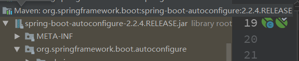

# 1、使用Thymeleaf

## 1.1、导入thymeleaf的启动器

~~~xml
<dependency>
    <groupId>org.springframework.boot</groupId>
    <artifactId>spring-boot-starter-thymeleaf</artifactId>
</dependency>
~~~

## 1.2、thyemeleaf的配置类



~~~java
@ConfigurationProperties(
    prefix = "spring.thymeleaf"
)
public class ThymeleafProperties {
    private static final Charset DEFAULT_ENCODING;
    public static final String DEFAULT_PREFIX = "classpath:/templates/";
    public static final String DEFAULT_SUFFIX = ".html";
    private boolean checkTemplate = true;
    private boolean checkTemplateLocation = true;
    private String prefix = "classpath:/templates/";
    private String suffix = ".html";
    private String mode = "HTML";
    private Charset encoding;
    private boolean cache;
    private Integer templateResolverOrder;
    private String[] viewNames;
    private String[] excludedViewNames;
    private boolean enableSpringElCompiler;
    private boolean renderHiddenMarkersBeforeCheckboxes;
    private boolean enabled;
    private final ThymeleafProperties.Servlet servlet;
    private final ThymeleafProperties.Reactive reactive;
~~~

在其中可以看到默认的前缀和后缀！我们只需要把我们的html页面放在类路径下的templates下，thymeleaf就可以帮我们自动渲染了

## 1.3在HTML中使用

我们要使用thymeleaf，需要在html文件中导入命名空间的约束，方便提示。我们可以去官方文档的#3中看一下命名空间拿来过来

官网：https://www.thymeleaf.org/documentation.html

```html
<html lang="en" xmlns:th="http://www.thymeleaf.org">
```

**一、我们可以使用任意的 th:attr 来替换Html中原生属性的值！【测试】 全部属性可以参考官网文档#10； th语法**


标准表达式功能的快速摘要：

- 简单表达式：
  - 变量表达式： `${...}`
  - 选择变量表达式： `*{...}`
  - 消息表达： `#{...}`
  - 链接URL表达式： `@{...}`
  - 片段表达式： `~{...}`
- 文字
  - 文本文字：`'one text'`，`'Another one!'`，...
  - 号码文字：`0`，`34`，`3.0`，`12.3`，...
  - 布尔文字：`true`，`false`
  - 空文字： `null`
  - 文字标记：`one`，`sometext`，`main`，...
- 文字操作：
  - 字符串串联： `+`
  - 文字替换： `|The name is ${name}|`
- 算术运算：
  - 二元运算符：`+`，`-`，`*`，`/`，`%`
  - 减号（一元运算符）： `-`
- 布尔运算：
  - 二元运算符：`and`，`or`
  - 布尔否定（一元运算符）： `!`，`not`
- 比较和平等：
  - 比较：`>`，`<`，`>=`，`<=`（`gt`，`lt`，`ge`，`le`）
  - 等号运算符：`==`，`!=`（`eq`，`ne`）
- 条件运算符：
  - 如果-则： `(if) ? (then)`
  - 如果-则-否则： `(if) ? (then) : (else)`
  - 默认： `(value) ?: (defaultvalue)`
- 特殊令牌：
  - 无操作： `_`

所有这些功能都可以组合和嵌套：

```html
'User is of type ' + (${user.isAdmin()} ? 'Administrator' : (${user.type} ?: 'Unknown'))
```

# 2、定义和引用片段

~~~html
<div class="layui-header" th:fragment="header">
<!-- th:insert="~{模块的路径 :: 模块名}" -->
<div th:insert="~{/views/components/components :: header}"></div>
<div th:replace="~{/views/components/components :: header}"></div>
~~~

